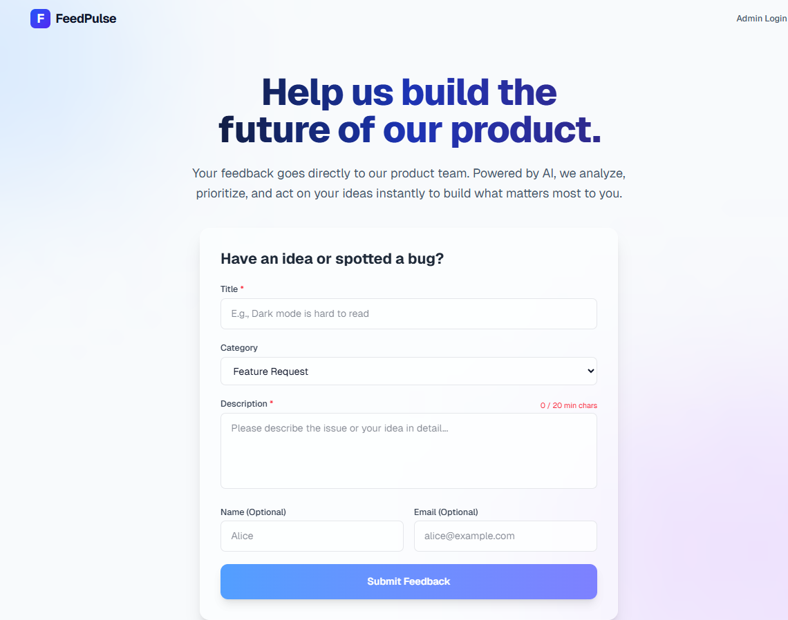
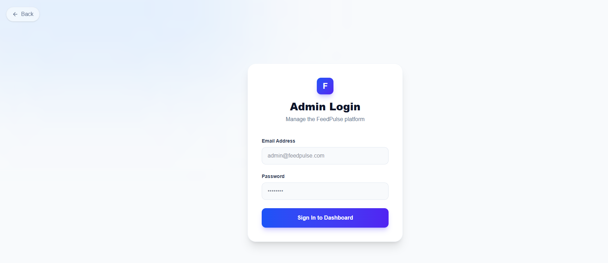
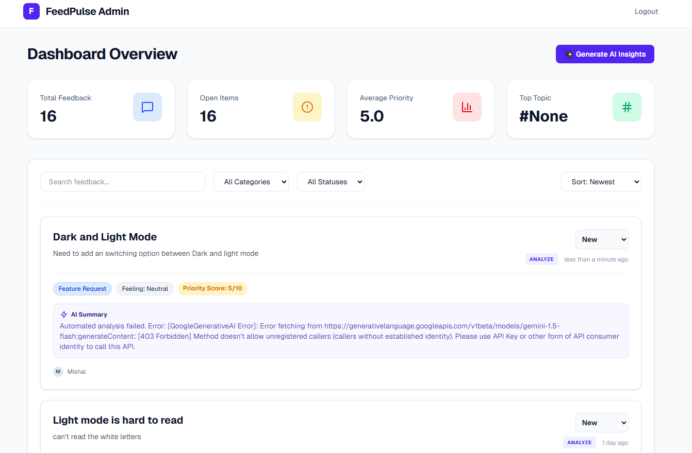

# FeedPulse 🚀

FeedPulse is an intelligent, AI-powered product feedback management platform. It allows users to submit feedback which is automatically categorized, analyzed for sentiment, and prioritized using the Google Gemini AI. An integrated Admin Dashboard provides comprehensive data visualization, insights, filtering, and a generated weekly AI summary of the most prominent feedback trends.

## 🛠️ Tech Stack

- **Frontend:** Next.js (React), Tailwind CSS, Lucide React
- **Backend:** Node.js, Express.js, TypeScript
- **Database:** MongoDB (Mongoose)
- **AI Integration:** Google Generative AI (Gemini 1.5 Flash)

---

## 📸 Screenshots

- **Public Feedback Form:**



- **Admin Dashboard & AI Summary:**




## 🚀 How to Run Locally

Follow these step-by-step instructions to get FeedPulse running flawlessly on your local machine.

### 1. Download and Extract the Project
1. Download the `FeedPulse` project as a ZIP file from GitHub (by clicking **Code > Download ZIP**).
2. Extract the downloaded ZIP file to a preferred location on your computer.
3. Open the extracted folder in your code editor (e.g., VS Code).

### 2. Set Up MongoDB
1. Create a free account on [MongoDB Atlas](https://www.mongodb.com/cloud/atlas/register) or use an existing one.
2. Create a new Cluster and set up a database user with a username and password.
3. In your cluster dashboard, click **Connect** -> **Connect your application**.
4. Copy your MongoDB Connection String (URI). It will look something like: `mongodb+srv://<username>:<password>@cluster0...`

### 3. Get Google Gemini API Key
1. Visit [Google AI Studio](https://aistudio.google.com/app/apikey).
2. Sign in with your Google account and click **Create API key**.
3. Copy the generated API key.

### 4. Configure Environment Variables
1. Navigate to the `backend` folder inside the project.
2. If there is already a `.env` file, open it. Otherwise, create a new file named exactly `.env`.
3. Add the following configuration, replacing the placeholder values with your actual MongoDB URI and Gemini API Key:

```env
PORT=5000
MONGODB_URI=your_mongodb_connection_string_here
GEMINI_API_KEY=your_gemini_api_key_here
JWT_SECRET=super_secret_jwt_key_here
```
*(Make sure to replace `<username>` and `<password>` inside the MongoDB connection string to match the user you created in Step 2!)*

### 5. Install Dependencies

You'll need to install the Node packages for **both** the frontend and the backend. Open your terminal or command prompt:

**For the Backend:**
1. Navigate to the backend directory:
   ```bash
   cd backend
   ```
2. Install the packages:
   ```bash
   npm install
   ```

**For the Frontend:**
1. Open a *new/second* terminal window and navigate to the frontend directory:
   ```bash
   cd frontend
   ```
2. Install the packages:
   ```bash
   npm install
   ```

### 6. Start the Development Servers

With everything installed and configured, you are ready to start both applications.

**Start the Backend:**
In your first terminal (inside the `backend` directory), run:
```bash
npm run dev
```
*(You should briefly see messages indicating the server is running on port 5000 and MongoDB is connected)*

**Start the Frontend:**
In your second terminal (inside the `frontend` directory), run:
```bash
npm run dev
```

### 7. Access the Application
- **Submit Feedback:** Open your web browser and navigate to `http://localhost:3000` to view the public form.
- **Admin Dashboard:** Navigate to `http://localhost:3000/admin/login` to access the Admin interface where you can view data insights and generate the weekly AI summary.

---

## 🔮 Future Improvements (What's Next?)

If given more time, here are the top features I would build next to improve FeedPulse:
1. **User Accounts & Authentication:** Allow public users to create accounts so they can track the status of their own feedback, receive email notifications when it's resolved, and upvote other users' feedback.
2. **Advanced Analytics Dashboard:** Implement charts (e.g., using Chart.js or Recharts) to visualize feedback trends over time, such as sentiment distribution by month or volume of bug reports vs. feature requests.
3. **Automated Feedback Routing:** Use the AI categorization to automatically assign feedback to specific departments (e.g., "Bug" -> Engineering, "UI" -> Design) and integrate with tools like Jira or Slack.
